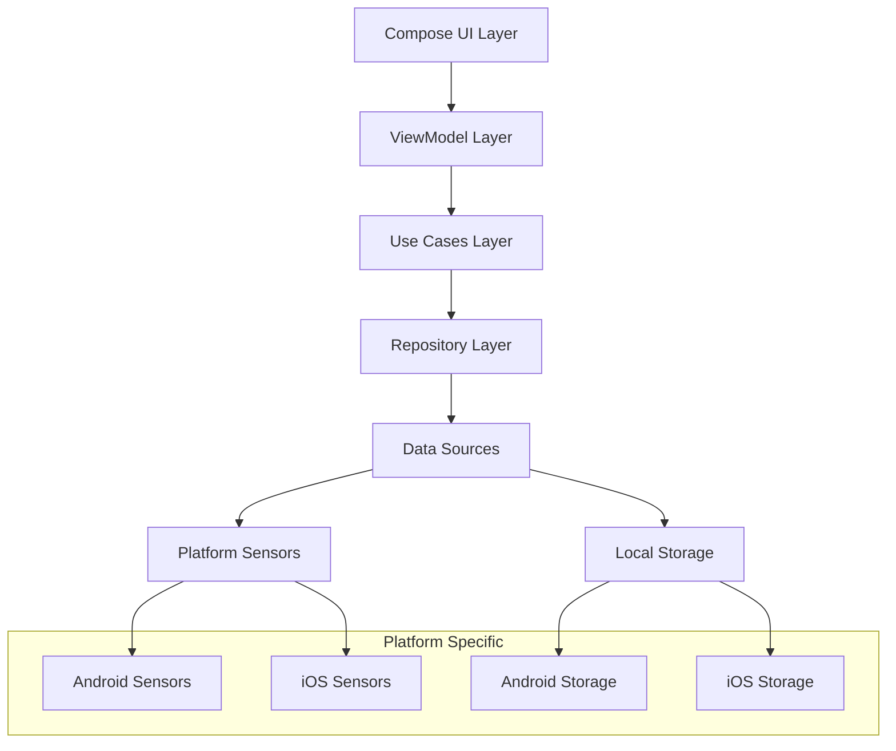

# Design Document

## Overview

TrueLevel is architected as a modern Kotlin Multiplatform application using MVI (Model-View-Intent) pattern with Compose Multiplatform for UI. The design emphasizes real-time sensor data processing, cross-platform consistency, and professional-grade user experience. The architecture separates concerns through clear layers: UI (Compose), State Management (ViewModels), Business Logic (Use Cases), and Platform Abstraction (Sensors).

## Architecture

### High-Level Architecture



### MVI Pattern Implementation

The application follows MVI pattern with the following components:

- **Model**: Immutable UI state representing current app state
- **View**: Compose UI functions that render state and emit intents
- **Intent**: User actions and system events that trigger state changes

### Module Structure

```
composeApp/
├── src/
│   ├── commonMain/kotlin/com/keisardev/truelevel/
│   │   ├── ui/
│   │   │   ├── screens/
│   │   │   ├── components/
│   │   │   └── theme/
│   │   ├── presentation/
│   │   │   ├── viewmodels/
│   │   │   └── state/
│   │   ├── domain/
│   │   │   ├── usecases/
│   │   │   ├── models/
│   │   │   └── repositories/
│   │   ├── data/
│   │   │   ├── repositories/
│   │   │   ├── datasources/
│   │   │   └── mappers/
│   │   └── di/
│   ├── androidMain/kotlin/com/keisardev/truelevel/
│   │   ├── sensors/
│   │   ├── storage/
│   │   └── platform/
│   └── iosMain/kotlin/com/keisardev/truelevel/
│       ├── sensors/
│       ├── storage/
│       └── platform/
```

## Components and Interfaces

### Core Domain Models

```kotlin
// Measurement data model
data class LevelMeasurement(
    val angleX: Double,
    val angleY: Double,
    val timestamp: Long,
    val accuracy: SensorAccuracy,
    val isLevel: Boolean,
    val levelStatus: LevelStatus
)

// Level status enumeration
enum class LevelStatus {
    LEVEL,      // Within ±1 degree
    CLOSE,      // 1-5 degrees
    NOT_LEVEL   // >5 degrees
}

// Measurement mode
enum class MeasurementMode {
    DIGITAL_INCLINOMETER,
    BUBBLE_LEVEL,
    ANGLE_DISPLAY
}
```

### UI State Management

```kotlin
// Main UI state
data class LevelUiState(
    val currentMeasurement: LevelMeasurement?,
    val measurementMode: MeasurementMode,
    val isHoldActive: Boolean,
    val heldMeasurement: LevelMeasurement?,
    val isLogging: Boolean,
    val calibrationOffset: CalibrationData?,
    val sensorStatus: SensorStatus,
    val batteryOptimizationEnabled: Boolean,
    val theme: AppTheme,
    val error: String?
)

// User intents
sealed class LevelIntent {
    object StartMeasurement : LevelIntent()
    object StopMeasurement : LevelIntent()
    object ToggleHold : LevelIntent()
    object ToggleLogging : LevelIntent()
    data class SwitchMode(val mode: MeasurementMode) : LevelIntent()
    object Calibrate : LevelIntent()
    object ClearError : LevelIntent()
}
```

### Sensor Abstraction Layer

```kotlin
// Cross-platform sensor interface
interface SensorManager {
    fun startSensorUpdates(callback: (SensorData) -> Unit)
    fun stopSensorUpdates()
    fun isAvailable(): Boolean
    fun getCurrentAccuracy(): SensorAccuracy
    suspend fun calibrate(): CalibrationData
}

// Platform-specific implementations
expect class PlatformSensorManager : SensorManager

// Sensor data model
data class SensorData(
    val accelerometerX: Float,
    val accelerometerY: Float,
    val accelerometerZ: Float,
    val gyroscopeX: Float?,
    val gyroscopeY: Float?,
    val gyroscopeZ: Float?,
    val timestamp: Long
)
```

### Data Persistence Layer

```kotlin
// Measurement logging interface
interface MeasurementRepository {
    suspend fun saveMeasurement(measurement: LevelMeasurement)
    suspend fun getMeasurementHistory(limit: Int = 100): List<LevelMeasurement>
    suspend fun exportMeasurements(format: ExportFormat): String
    suspend fun clearHistory()
}

// Settings persistence
interface SettingsRepository {
    suspend fun saveCalibration(calibration: CalibrationData)
    suspend fun getCalibration(): CalibrationData?
    suspend fun savePreferences(preferences: UserPreferences)
    suspend fun getPreferences(): UserPreferences
}
```

## Data Models

### Measurement Processing

The sensor data processing pipeline:

1. **Raw Sensor Data**: Accelerometer and gyroscope readings
2. **Filtering**: Low-pass filter for noise reduction
3. **Calibration**: Apply user calibration offsets
4. **Angle Calculation**: Convert to pitch/roll angles
5. **Level Status**: Determine level status based on thresholds
6. **UI State**: Update reactive UI state

### Calibration Data

```kotlin
data class CalibrationData(
    val offsetX: Double,
    val offsetY: Double,
    val timestamp: Long,
    val deviceOrientation: DeviceOrientation
)

enum class DeviceOrientation {
    PORTRAIT,
    LANDSCAPE_LEFT,
    LANDSCAPE_RIGHT,
    PORTRAIT_UPSIDE_DOWN
}
```

### Export Formats

```kotlin
sealed class ExportFormat {
    object CSV : ExportFormat()
    object PDF : ExportFormat()
    object JSON : ExportFormat()
}

data class MeasurementExport(
    val measurements: List<LevelMeasurement>,
    val exportTimestamp: Long,
    val calibrationInfo: CalibrationData?,
    val deviceInfo: DeviceInfo
)
```

## Error Handling

### Error Types

```kotlin
sealed class LevelError {
    object SensorNotAvailable : LevelError()
    object SensorPermissionDenied : LevelError()
    data class SensorAccuracyLow(val accuracy: SensorAccuracy) : LevelError()
    object CalibrationRequired : LevelError()
    data class StorageError(val message: String) : LevelError()
    data class ExportError(val message: String) : LevelError()
}
```

### Error Recovery Strategies

1. **Sensor Errors**: Graceful degradation with user notification
2. **Permission Errors**: Clear guidance for enabling permissions
3. **Storage Errors**: Fallback to memory-only operation
4. **Calibration Errors**: Reset to default calibration with warning

## Testing Strategy

### Unit Testing

- **Domain Layer**: Test measurement calculations and business logic
- **Data Layer**: Test repository implementations and data transformations
- **Presentation Layer**: Test ViewModel state management and intent handling

### Integration Testing

- **Sensor Integration**: Test sensor data flow through the system
- **Storage Integration**: Test data persistence and retrieval
- **Cross-Platform**: Verify consistent behavior across platforms

### UI Testing

- **Compose Testing**: Test UI components and interactions
- **Screenshot Testing**: Verify visual consistency across devices
- **Accessibility Testing**: Ensure proper screen reader support

### Performance Testing

- **Sensor Performance**: Measure update rates and battery impact
- **Memory Usage**: Monitor memory consumption during continuous operation
- **Battery Testing**: Validate power optimization strategies

## UI/UX Design Specifications

### Visual Hierarchy

1. **Primary**: Current measurement display (large, prominent)
2. **Secondary**: Level status indicator (color-coded)
3. **Tertiary**: Mode indicators and controls
4. **Quaternary**: Settings and additional features

### Color System

```kotlin
object LevelColors {
    val Level = Color(0xFF4CAF50)        // Green - Level
    val Close = Color(0xFFFF9800)        // Orange - Close to level
    val NotLevel = Color(0xFFF44336)     // Red - Not level
    val Background = Color(0xFF121212)    // Dark background
    val Surface = Color(0xFF1E1E1E)      // Surface color
    val OnSurface = Color(0xFFFFFFFF)    // Text on surface
}
```

### Typography

- **Display Large**: Measurement values (48sp, bold)
- **Headline Medium**: Mode titles (24sp, medium)
- **Body Large**: Status text (16sp, regular)
- **Label Medium**: Button text (14sp, medium)

### Component Specifications

#### Digital Inclinometer Display

```kotlin
@Composable
fun DigitalInclinometerDisplay(
    measurement: LevelMeasurement,
    isHeld: Boolean,
    modifier: Modifier = Modifier
) {
    Column(
        modifier = modifier.fillMaxSize(),
        horizontalAlignment = Alignment.CenterHorizontally,
        verticalArrangement = Arrangement.Center
    ) {
        // Large angle display
        Text(
            text = "${measurement.angleX.format(1)}°",
            style = MaterialTheme.typography.displayLarge,
            color = measurement.levelStatus.color
        )
        
        // Level status indicator
        LevelStatusIndicator(
            status = measurement.levelStatus,
            isHeld = isHeld
        )
        
        // Secondary angle (Y-axis)
        Text(
            text = "Y: ${measurement.angleY.format(1)}°",
            style = MaterialTheme.typography.bodyLarge
        )
    }
}
```

#### Bubble Level Display

```kotlin
@Composable
fun BubbleLevelDisplay(
    measurement: LevelMeasurement,
    modifier: Modifier = Modifier
) {
    Box(
        modifier = modifier.fillMaxSize(),
        contentAlignment = Alignment.Center
    ) {
        // Level vial background
        LevelVial(
            modifier = Modifier.size(300.dp, 80.dp)
        )
        
        // Animated bubble
        AnimatedBubble(
            angleX = measurement.angleX,
            angleY = measurement.angleY,
            modifier = Modifier.size(40.dp)
        )
        
        // Level markers
        LevelMarkers()
    }
}
```

### Accessibility Features

- **Screen Reader Support**: Comprehensive content descriptions
- **High Contrast Mode**: Enhanced visibility for low vision users
- **Large Text Support**: Scalable typography
- **Voice Announcements**: Audio feedback for level status changes
- **Haptic Feedback**: Tactile confirmation for level achievement

### Responsive Design

- **Phone Portrait**: Single measurement display
- **Phone Landscape**: Side-by-side dual axis display
- **Tablet**: Enhanced layout with measurement history sidebar
- **Foldable**: Adaptive layout for different screen configurations

## Platform-Specific Considerations

### Android Implementation

```kotlin
actual class PlatformSensorManager : SensorManager {
    private val sensorManager = context.getSystemService(Context.SENSOR_SERVICE) as android.hardware.SensorManager
    private val accelerometer = sensorManager.getDefaultSensor(Sensor.TYPE_ACCELEROMETER)
    private val gyroscope = sensorManager.getDefaultSensor(Sensor.TYPE_GYROSCOPE)
    
    override fun startSensorUpdates(callback: (SensorData) -> Unit) {
        // Android-specific sensor registration
        sensorManager.registerListener(
            sensorEventListener,
            accelerometer,
            SensorManager.SENSOR_DELAY_GAME
        )
    }
}
```

### iOS Implementation

```kotlin
actual class PlatformSensorManager : SensorManager {
    private val motionManager = CMMotionManager()
    
    override fun startSensorUpdates(callback: (SensorData) -> Unit) {
        // iOS-specific Core Motion implementation
        motionManager.startDeviceMotionUpdates(
            to: OperationQueue.main
        ) { motion, error ->
            motion?.let { 
                callback(it.toSensorData())
            }
        }
    }
}
```

### Performance Optimizations

1. **Sensor Sampling**: Adaptive sampling rates based on device movement
2. **Battery Management**: Reduce updates when device is stationary
3. **Memory Management**: Efficient state updates and garbage collection
4. **Background Handling**: Proper lifecycle management for sensor operations

This design provides a solid foundation for implementing TrueLevel as a professional-grade measurement tool while maintaining cross-platform consistency and optimal performance.